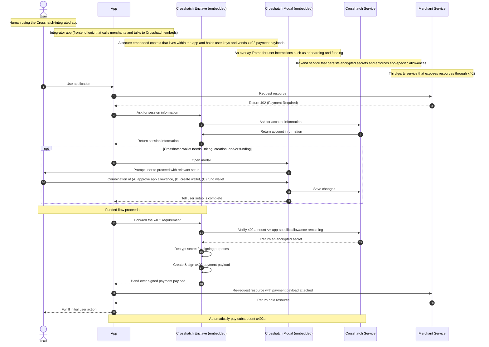

# Lifecycle

Crosshatch fits between apps that request paid resources and merchants that return x402 payment requirements. Apps do
not hold user private keys, register server-side API keys, or maintain separate staging payment credentials. The same
client integration can work end-to-end in development and production because Crosshatch owns wallet setup, funding,
allowance approval, and payment payload generation.

This makes Crosshatch especially useful for generated or rapidly assembled app UIs: when a paid resource returns `402`,
the app can ask Crosshatch for a payment payload and retry the request without first provisioning merchant-specific
payment infrastructure.

::::steps

### Initial Request

The user triggers an action in the app. The app requests a resource from a merchant, which responds with a 402.

### Payment Requirement

The merchant's `402` includes a machine-readable x402 requirement: the price, network, asset, recipient, and resource
context needed to pay for the requested resource.

### Session Check

The app asks Crosshatch whether an allowance has already been granted.

### Wallet Onboarding (if needed)

If the app lacks an allowance, a modal (or popup depending on browser) appears and guides the user through the necessary
steps: allowance approval and/or wallet funding. Once complete, the modal closes.

### Payment Signing

With a funded wallet and the appropriate approval, the app forwards the x402 requirement to Crosshatch. Crosshatch
returns a signed payment payload that the app can send back to the merchant.

:::note User private keys never leave the Crosshatch wallet context. Apps receive signed x402 payment payloads, not raw
signing material. :::

### Resource Delivery

The app retries the original request with the signed payment payload attached. The merchant verifies the payload and
returns the paid resource. The app fulfills the user's original action.

### Subsequent Payments

All future x402 payments within the user's allowance can be handled automatically - no further prompts necessary.

::::

## Diagram

The full lifecycle of a Crosshatch session is as follows - from the initial user action through wallet setup, payment
signing, and resource delivery.

